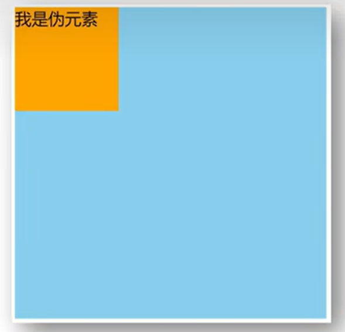
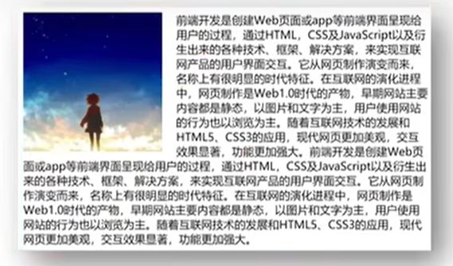

# CSS浮动目录

- 结构伪类选择器
- 伪元素
- 标准流
- 浮动
- 清除浮动

# 结构伪类选择器

目标：能够使用结构伪类选择器在HTML中定位元素

作用与优势

1. 作用：根据元素在HTML中的结构关系查找元素
2. 优势：减少对于HTML中类的依赖，有利于保持代码整洁
3. 场景：常用于查找某父级选择器中的子元素

选择器：

| 选择器                  | 说明                                     |
| ----------------------- | ---------------------------------------- |
| `E:first-child{}`       | 匹配父元素中第一个子元素，并且是E元素    |
| `E:last-child{}`        | 匹配父元素中最后一个子元素，并且是E元素  |
| `E:nth-child(n){}`      | 匹配父元素中第n个子元素，并且是E元素     |
| `E:nth-last-child(n){}` | 匹配父元素中倒数第n个子元素，并且是E元素 |

n的注意点：

1. n为：0、1、2、3、4、5、6……
2. 通过n可以组成常见公式

| 功能            | 公式            |
| --------------- | --------------- |
| 偶数            | 2n、even        |
| 奇数            | 2n+1、2n-1、odd |
| 找到前5个       | -n+5            |
| 找到从第5个往后 | n+5             |

# 伪元素

目标：能够使用伪元素在网页中创建内容

伪元素：一般页面中的非主体内容可以使用伪元素

区别：

1. 元素：HTML设置的标签
2. 伪元素：由CSS模拟出的标签效果

种类：

| 伪元素     | 作用                             |
| ---------- | -------------------------------- |
| `::before` | 在父元素内容的最前添加一个伪元素 |
| `::after`  | 在父元素内容的最后添加一个伪元素 |

注意点：

1. 必须设置content属性才能生效
2. 伪元素默认是行内元素



# 标准流

目标：能够认识标准流的默认排布方式及其特点

标准流：又称文档流，是浏览器在渲染显示网页内容时默认采用的一套排版规则，规定了应该以何种方式排列元素

常见标准流排版规则：

1. 块级元素：从上往下，垂直布局，独占一行
2. 行内元素 或 行内块元素：从左往右，水平布局，空间不够自动折行

# 浮动

目标：能够认识使用浮动的作用，了解浮动的特点

学习路径：

1. 浮动的作用
2. 浮动的代码
3. 浮动的特点
4. 浮动的案例

## 浮动的作用

早期的作用：图文环绕



现在的作用：网页布局

## 浮动的代码

float：left

float：right

## 浮动的特点

1. 浮动元素会脱离标准流（简称：脱标），在标准流中不占位置
    - 相当于从地面飘到了空中
2. 浮动元素比标准流高半个级别，可以覆盖标准流中的元素
3. 浮动找浮动，下一个浮动元素会在上一个浮动元素后面左右排列
4. 浮动元素有特殊的显示效果
    - 一行可以显示多个
    - 可以设置宽高

# 拓展-CSS属性顺序

CSS书写顺序：浏览器执行效率更高

1. 浮动 / display
2. 盒子模型：边距margin 边框border 填充padding 宽度高度背景色
3. 文字样式

可以先按照正常的思路，先写长宽背景色，而后往上面添加浮动即可

# 清除浮动

## 介绍

含义：清除浮动带来的影响

- ​	影响：如果子元素浮动了，此时子元素不能撑开标准流的块级父元素

原因：

- ​	子元素浮动后脱标 —> 不占位置

目的：

- ​	需要父元素有高度，从而不影响其他网页元素的布局

## 方法一——直接设置父元素高度

## 方法二——额外标签法

操作：

1. 在父元素内容的最后添加一个块级元素
2. 给添加的块级元素设置`clear:both`

特点：

- 缺点：会在页面中添加额外的标签，会让页面的HTML结构变得复杂

## 方法三——单伪元素清除法

操作：用伪元素替代了额外标签

①：基本写法

```css
.clearfix::after{
	content:'';
    display:block;
    clear:both;
}
```

②：补充写法

```css
.clearfix::after{
    content:'';
    display:block;
    clear:both;
    /*补充代码：在网页中看不到伪元素*/
    height:0;
    visibility:hidden;
}
```

特点：

- 优点：项目中使用，直接给标签加类即可清除浮动

## 方法四——双伪元素清除法

加before和after

特点：

- 优点：项目中使用，直接给标签加类即可清除浮动
- 不光能清除浮动，还可以解决外边距塌陷问题

display:table	转成表格的显示模式

clear:both	清除浮动

```css
/* .clearfix::before 作用：解决外边距塌陷问题
	外边距塌陷：父子标签，都是块级，子级加margin会影响父级的位置
	因此显示模式转成table，就不会出现外边距塌陷问题 */
/* 清除浮动 */
.clearfix::before,
.clearfix::after {
	content: "";
    display: table;
}
/* 真正清除浮动的标签 */
.clearfix::after {
	clear: both;
}
```

## 方法五——给父元素设置overflow:hidden

操作：

1. 直接给父元素设置overflow:hidden

特点：

- 优点：方便


